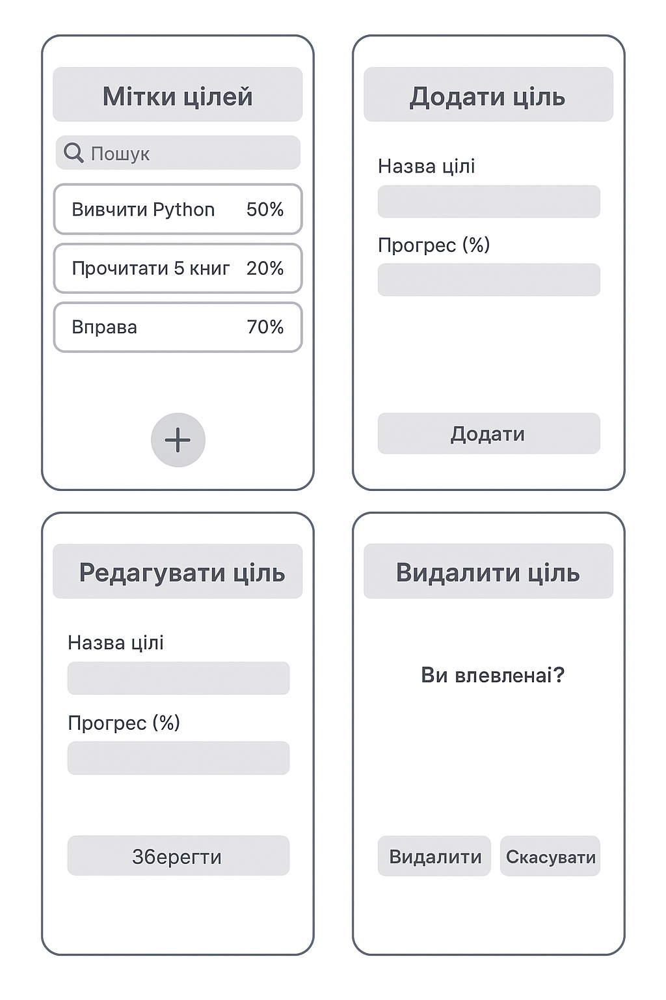

Лабораторна робота №3
Тема: Software Development Life Cycle (SDLC)  
Студент: [Шевченко Ростислав]  
Варіант: 23 — Трекер навчальних цілей  


1. Планування
Мета продукту:  
Користувач повинен мати можливість створювати список навчальних цілей та відстежувати прогрес їх виконання у відсотках.


2. Аналіз вимог (User Stories)

| №  | User Story
| 1  | Як користувач, я хочу додавати нову навчальну ціль, щоб відслідковувати її виконання.
| 2  | Як користувач, я хочу змінювати прогрес цілі (у %), щоб бачити свій розвиток.
| 3  | Як користувач, я хочу редагувати назву цілі, щоб виправляти помилки.
| 4  | Як користувач, я хочу видаляти навчальну ціль, щоб очищати список.
| 5  | Як користувач, я хочу бачити всі мої цілі у вигляді списку з % прогресу.

3. Дизайн (Прототип)

- Головний екран: список навчальних цілей із відображенням % виконання.  
- Екран редагування/додавання: форма з полем для назви цілі та полем введення відсотків.  

📷 Прототип у файлі: `prototype.png`  



4. Реалізація


```python
def updateGoalProgress(goalName, percent):
    if percent < 0 or percent > 100:
        return "Error: Progress must be between 0 and 100"
    else:
        goal = findGoal(goalName)
        goal.progress = percent
        return "Progress updated successfully"
```


5. Тестування

* Змінити прогрес цілі **“Вивчити Python”** на `50%` → у списку відображається **50%**.
* Ввести прогрес `-10%` → система видає помилку (**Progress must be between 0 and 100**).
* Видалити ціль **“Прочитати 5 книг”** → вона зникає зі списку.
* Додати ціль з порожньою назвою → система видає помилку і не додає ціль.
* Редагувати ціль: змінити назву **“Вивчити Python”** на **“Вивчити Python (базовий курс)”** і прогрес на `60%` → у списку відображаються оновлена назва і `60%`.


6. Висновок

Для цього застосунку найкраще підходить Agile-модель, бо вона дозволяє швидко додавати нові функції (наприклад, дедлайни чи категорії цілей) і реагувати на відгуки користувачів.


